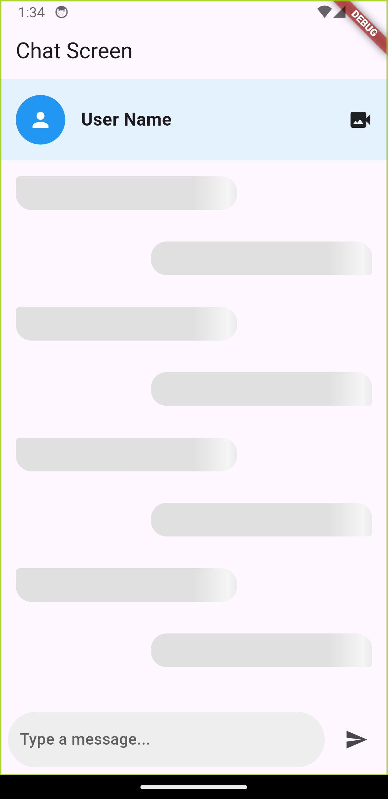
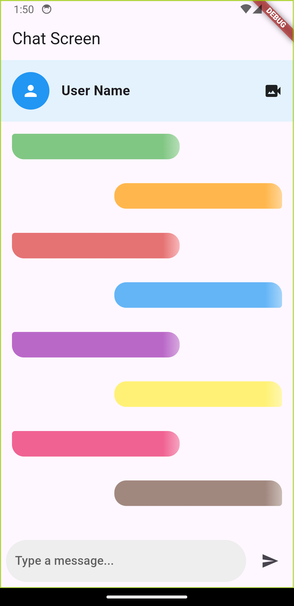

<!--
This README describes the package. If you publish this package to pub.dev,
this README's contents appear on the landing page for your package.

For information about how to write a good package README, see the guide for
[writing package pages](https://dart.dev/guides/libraries/writing-package-pages).

For general information about developing packages, see the Dart guide for
[creating packages](https://dart.dev/guides/libraries/create-library-packages)
and the Flutter guide for
[developing packages and plugins](https://flutter.dev/developing-packages).
-->

T# skeleton_chat_loader

A Flutter package that provides customizable shimmer loading animations for chat message bubbles, perfect for chat applications while loading messages or waiting for network responses.

## Features

- Customizable message bubble dimensions
- Sender/Receiver message bubble styles
- Configurable shimmer colors
- Smooth animation transitions
- Responsive design

## Screenshots


*Basic Loading Example*


*Basic Loading Example*

## Installation

Add this to your package's `pubspec.yaml` file:

```yaml
dependencies:
  skeleton_chat_loader: ^1.0.0
```

Run:
```bash
flutter pub get
```

## Usage

Import the package:

```dart
import 'package:skeleton_chat_loader/skeleton_chat_loader.dart';
```

### Basic Usage

```dart
// Simple message loading skeleton
MessageShimmerLoading(
  height: 50,
  isSender: false,
  maxWidth: 280,
)
```

### Customized Loading Skeleton

```dart
// Customized message loading skeleton with custom colors
MessageShimmerLoading(
  height: 70,
  isSender: true,
  maxWidth: 320,
  shimmerColors: [
    Colors.blue.shade100,
    Colors.blue.shade50,
    Colors.blue.shade100,
  ],
)
```

### Example in a Chat List

```dart
ListView.builder(
  itemCount: 5, // Number of loading skeletons
  itemBuilder: (context, index) {
    return MessageShimmerLoading(
      height: 50,
      isSender: index % 2 == 0, // Alternate between sender and receiver
      maxWidth: 280,
    );
  },
)
```

## Parameters

| Parameter | Type | Default | Description |
|-----------|------|---------|-------------|
| height | double | 50 | Height of the message bubble |
| isSender | bool | false | Whether the message is from the sender |
| maxWidth | double | 280 | Maximum width of the message bubble |
| shimmerColors | List<Color>? | null | Custom colors for shimmer effect |

## Contributing

Feel free to contribute to this package by creating issues or submitting pull requests on our GitHub repository.

## License

This project is licensed under the MIT License - see the LICENSE file for details.